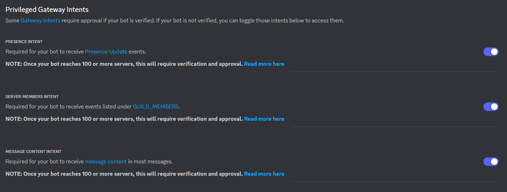
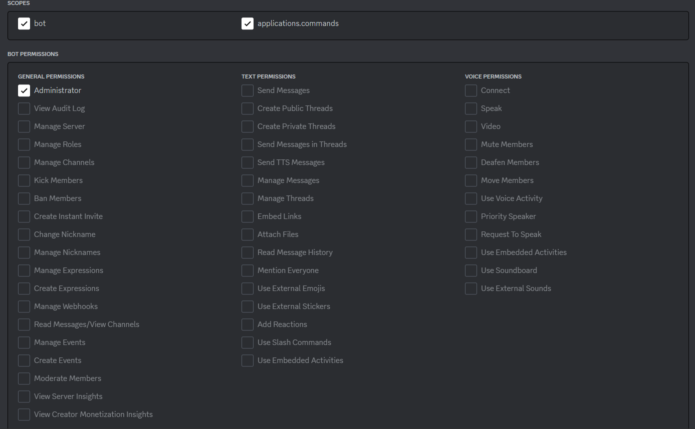
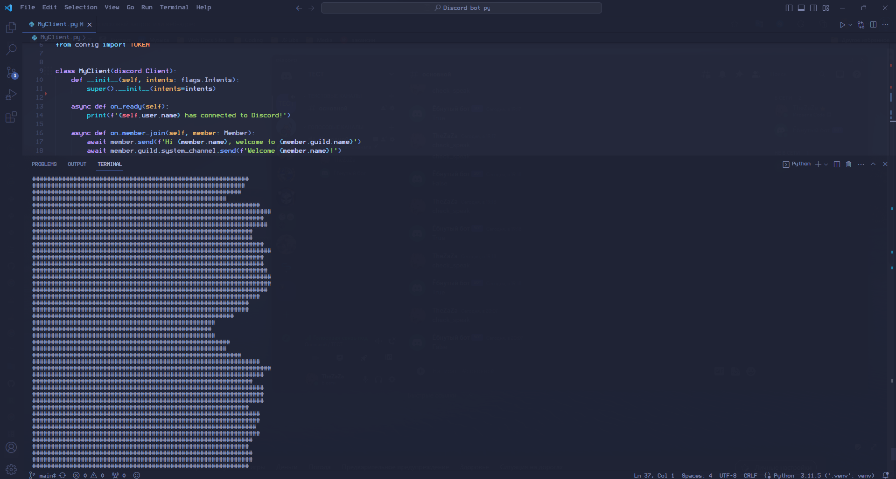

# Что это?
Просто хотел поработать с ботами в discord.
В итоге 'перелилось' во что-то такое.
## Для установки 
``` 
pip3 install discord 
```
``` 
pip3 install discord-ext-voice-recv 
```
## Как запустить
### Для начала
[Создать бота для ds](https://discord.com/developers/applications)
### Потом

### И вот это

### Копируешь token
## В консоли 
``` 
python MyClient.py <TOKEN> 
```
### Заходишь на сервер заходишь в голосовой канал и смотришь в консоль
## Итог

